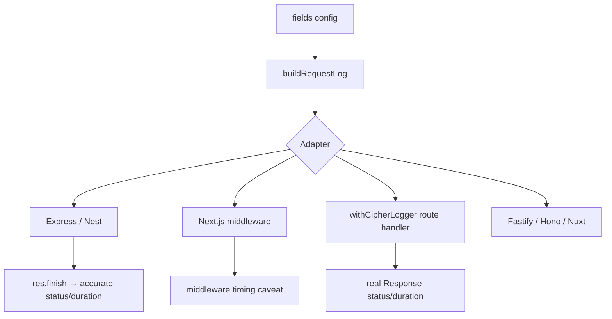

# Architecture

CipherLogger is split into a framework-agnostic **core** and thin, per-framework **adapters**. Adapters ship as separate entry points so importing the core package does not load Express, Next.js, or other peers.

## Package layout

```text
cipher-logger/
├── src/
│   ├── core/                 # Field config, Logger, createCipherLogger
│   ├── adapters/
│   │   ├── express/
│   │   ├── next/
│   │   ├── nuxt/
│   │   ├── fastify/
│   │   ├── nest/
│   │   └── hono/
│   ├── index.ts              # Public core entry
│   ├── express.ts            # Subpath: cipher-logger/express
│   ├── next.ts               # Subpath: cipher-logger/next
│   └── …                     # Other adapter entries
└── dist/                     # Built CJS + ESM + types
```

## Data flow



1. **Core** owns `fields` configuration and `buildRequestLog`.
2. **Adapters** extract framework-specific data and call `cipher.logRequest(...)`.
3. Convenience methods like `cipher.express()` lazy-load the matching `dist/<adapter>` chunk at call time so unused peers are never required.

## Why this split?

- **Small surface area per adapter.** Adding a framework means a thin adapter file plus a subpath entry.
- **Optional peers stay optional.** `require("cipher-logger")` / `import "cipher-logger"` does not load `next` or `express`.
- **Typed imports when you need them.** Prefer `import { createExpressMiddleware } from "cipher-logger/express"` for full framework types.

## Public entry points

| Import | Contents |
| ------ | -------- |
| `cipher-logger` | `createCipherLogger`, `Logger`, core types |
| `cipher-logger/express` | `createExpressMiddleware` |
| `cipher-logger/next` | `createNextMiddleware`, `withCipherLogger` |
| `cipher-logger/fastify` | `createFastifyMiddleware` |
| `cipher-logger/hono` | `createHonoMiddleware` |
| `cipher-logger/nest` | `createNestMiddleware` |
| `cipher-logger/nuxt` | `createNuxtMiddleware` |
