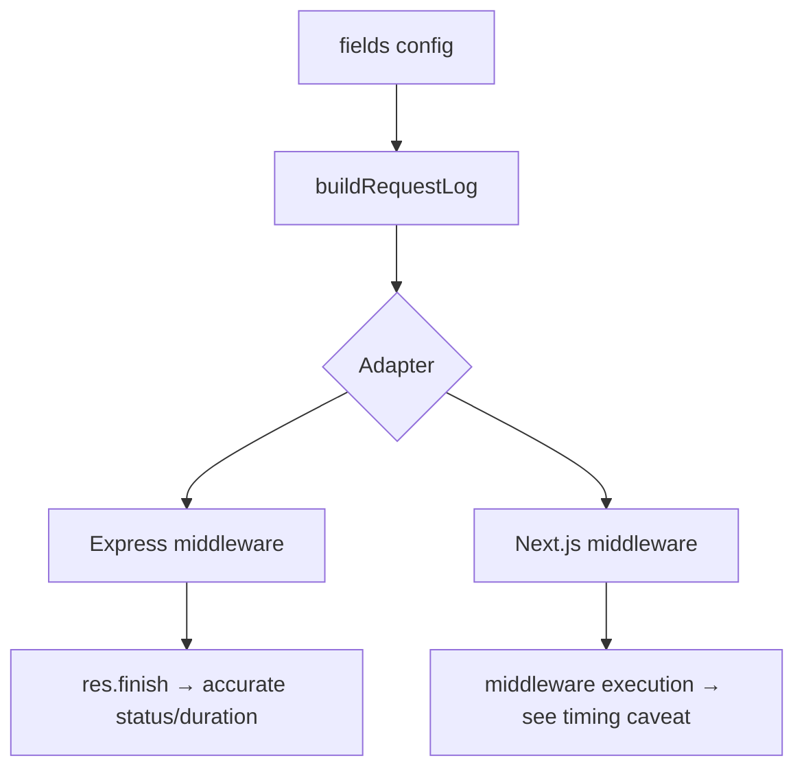

# Architecture

CipherLogger is split into a framework-agnostic **core** and thin, per-framework **adapters**. This keeps the dependency footprint small — you only pull in the adapter for the framework you actually use — and keeps the logging logic itself easy to test in isolation.

## Package layout

```text
cipher-logger/
├── src/
│   ├── core/            # Core — field config & log building
│   │   ├── logger.ts
│   │   ├── types.ts
│   │   ├── build-request-log.ts
│   │   └── create-cipher-logger.ts
│   ├── express/          # Express adapter
│   │   └── middleware.ts
│   ├── next/             # Next.js adapter
│   │   └── middleware.ts
│   └── index.ts           # Public entry point
```

## Data flow



1. **Core** owns the `fields` configuration and `buildRequestLog`, which assembles a `RequestLog` object from raw request/response data and whatever optional fields are enabled.
2. **Adapters** are responsible only for extracting framework-specific data (headers, timing hooks, request/response objects) and handing it to core in a normalized shape.
3. Each adapter decides *when* logging happens — Express logs on `res.finish` (after the real response), while the Next.js adapter currently logs during middleware execution (see the [timing caveat](../guide/nextjs.md#timing-caveat)).

## Why this split?

- **Small surface area per adapter.** Adding a new framework (Fastify, Hono, NestJS, Nuxt — see the [Roadmap](roadmap.md)) means writing a thin file that maps that framework's request lifecycle onto core, not reimplementing field logic.
- **Zero unnecessary dependencies.** `express` and `next` are optional peer dependencies — installing CipherLogger doesn't pull in either unless you import that adapter.
- **Testable core.** `buildRequestLog` and `Logger` have no framework dependencies, so they're covered by plain unit tests independent of any HTTP server.

## Public entry point

`src/index.ts` re-exports everything documented in the [API Reference](../reference/api.md): `createCipherLogger`, `Logger`, and every public type. Adapters are not imported eagerly — `cipher.express()` and `cipher.next()` are resolved lazily so that, for example, requiring `next` doesn't happen in a pure-Express project.
